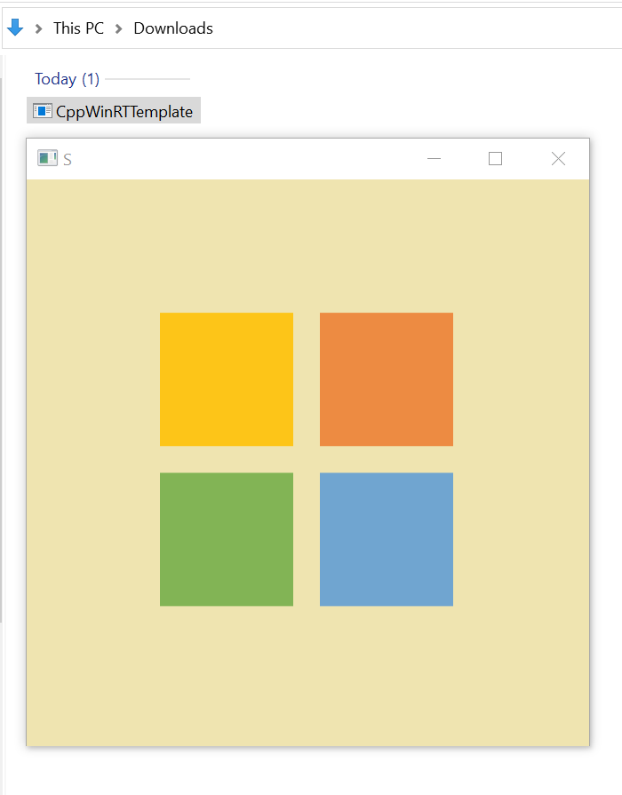
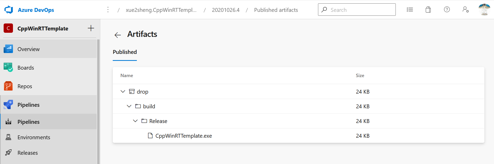

# CppWinRTTemplate
Basic template for C++/WinRT projects based on [kennykerr/DesktopComposition.cpp](https://gist.github.com/kennykerr/62923cdacaba28fedc4f3dab6e0c12ec)

# Azure DevOps
Provided Azure DevOps YAML in order to generate binary [CppWinRTTemplate](https://andressevillanovallejo.visualstudio.com/CppWinRTTemplate/_build/results?buildId=8&view=artifacts&type=publishedArtifacts).

Being a temporay remote build, don't hesitate to use your own Azure account and check the artifact created by that job.

